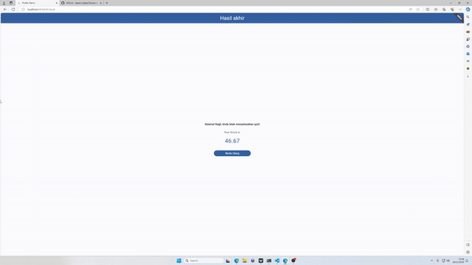

# Quizzo App Flutter

## Contents

- [Description](#description)
- [Features](#features)
- [Requirements](#requirements)
- [Installation](#installation)
- [Screenshots](#screenshots)

## Description

**Quizzo App Flutter** is a Quiz App built on Flutter. Quizz support responsive screen, it means this App can be used for mobile app, tablet, and desktop.

## Features

- responsive layout for mobile apps and web app
- Quiz
- Check which quiz is not answered yet
- Quiz Result
- Qustions with or without image

## Requirements

- `flutter sdk ">=3.0.5 <4.0.0"`

## Installation

1. Open your terminal or command prompt
2. Clone the project

```bash
$ git clone git@github.com:sipamungkas/Quizzo-a-quiz-app-flutter.git
```

3. Move inside the directory and install and link dependency

```bash
$ cd Quizzo-a-quiz-app-flutter
$ flutter pub get
```

4. Run program

- run on chrome

```bash
$ flutter run -d chrome
```

- run on android

```bash
$ flutter run -d YOUR_ANDROID_DEVICE
```

5. Build Apps

- [Publishing for Google Play](https://docs.flutter.dev/deployment/android)

- [Publishing for Apple Store](https://docs.flutter.dev/deployment/ios)

## Screenshots

<div style="text-align:center">
<h3> Mobile Preview </h3>

<h3> Web Preview </h3>

